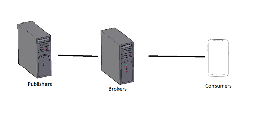

# Distracks - Distributed Player
A Music Streaming Service developed with Socket Programming in Java and an Android application which uses this service to download and stream songs.
### Architecture:

***
### Android Application:

***

***

***
Online and Offline Player: 

